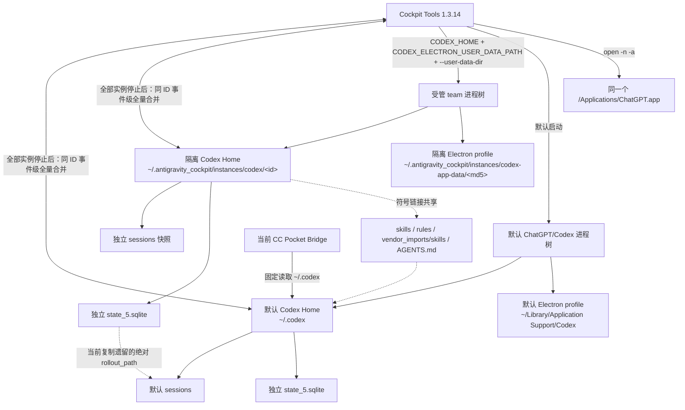
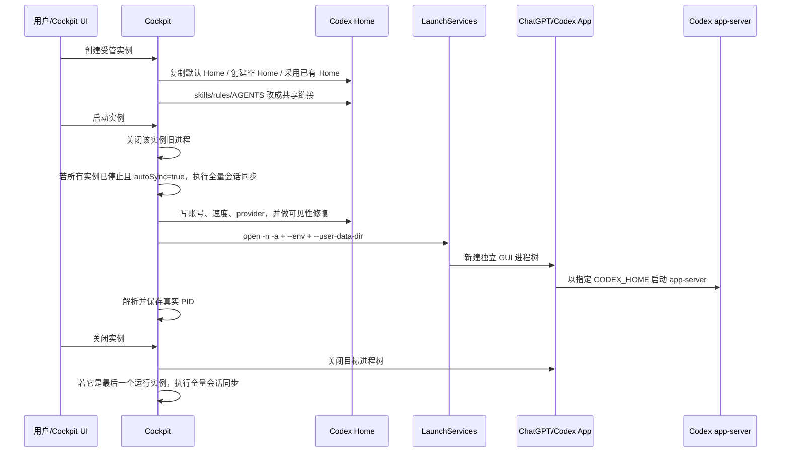

# Cockpit Tools 如何实现 Codex Desktop 多实例

> 文档状态：reference / evidence-backed investigation
>
> 取证时间：2026-07-26 00:26–01:20 +0800
>
> 本机版本：macOS、Cockpit Tools 1.3.14、ChatGPT/Codex Desktop
> 26.721.41059（内置 `codex-cli 0.146.0-alpha.3.1`）
>
> 用途：解释当前 Cockpit 多开 Codex 的真实机制、同步算法、已确认风险，以及把
> 同类分析迁移到其他桌面软件时应检查的边界。

本文只记录只读取证结果，没有修改 Cockpit、Codex、Bridge、Mobile、系统服务或
账号配置。文中所有“当前”都绑定上述版本和取证时间；Cockpit 或 Codex 升级后应
重新核对源码与现场状态。

## 1. 先说结论

Cockpit 的 Codex 多开不是虚拟机、容器，也不是复制一份
`/Applications/ChatGPT.app`。它复用同一个已安装 App，通过三层隔离启动另一个
进程树：

1. macOS `open -n -a` 要求 LaunchServices 新开一个 App 实例；
2. `CODEX_ELECTRON_USER_DATA_PATH` 和 `--user-data-dir` 把 Chromium/Electron
   Cookies、Local Storage、IndexedDB、Cache、窗口状态等放到另一目录；
3. `CODEX_HOME` 把 Codex 的认证、配置、状态库、日志、会话、记忆和工具运行目录
   指到另一棵目录。

随后 Cockpit 有选择地把 `skills`、`rules`、`vendor_imports/skills` 和
`AGENTS.md` 链接回默认 `~/.codex`，所以它是“多数状态隔离、少数规则共享”，不是
完全隔离。

当前本机最关键的结论有四个：

- 两个实例有独立的 Electron profile 和独立的 `state_5.sqlite`，但 Cockpit 创建
  `team` 实例时复制了整棵默认 `~/.codex`。
- 被复制的 `state_5.sqlite` 保留了指向默认
  `/Users/huyiyang/.codex/sessions/...` 的绝对 `rollout_path`。因此当前 Cockpit
  app-server 一边写自己的状态库，一边仍会打开默认实例的部分会话文件。
- Cockpit 的自动同步不是运行时实时同步；它只在所有 Codex 实例停止后进行。
  全量同步会对同 ID rollout 做“事件行级合并”，而单独复制/导入会话则对同 ID
  直接跳过。这是两套不同语义。
- 当前两套 `sessions` 逻辑数据规模各约 26 GiB，最大单文件约 2.81 GB。Cockpit
  1.3.14 的全量同步算法会对文件做多次整文件读取，并把单个同 ID 会话的内容读入
  内存后去重和排序。对当前数据规模，自动全量同步存在明显的 I/O、内存和卡死
  风险，不宜直接触发。

## 2. 当前架构图



这张图最容易被误解的地方是：`team/sessions` 确实存在独立副本，但当前
`team/state_5.sqlite` 里的大量路径仍指向默认 `~/.codex/sessions`。所以“有两份
文件”不等于“运行时一定只读自己的那份”。

## 3. 多开分成哪几层

### 3.1 进程层：强制新开同一个 App

macOS 平常通过 Dock 或 `open -a` 启动 App 时，LaunchServices 可能只激活已经
运行的同 bundle 实例。Cockpit 使用：

```text
open -n -a /Applications/ChatGPT.app
```

`-n` 的系统含义是：即使应用已经运行，也请求一个新实例。Cockpit 还通过
`open --env` 注入环境变量，并通过 App 参数传入 `--user-data-dir`。

这一步只解决“新开一个进程树”，不自动解决数据目录、账号、端口、Keychain、
后台服务或会话文件冲突。

当前现场确实同时存在两个主进程：

| 实例 | 审计时主进程 | 启动方式 |
|---|---:|---|
| 默认 | PID 3754 | `/Applications/ChatGPT.app/Contents/MacOS/ChatGPT` |
| Cockpit `team` | PID 36825 | 同一主程序，加隔离的 `--user-data-dir=...` |

PID 会变化，只用于证明这次现场确实是两个独立进程树。

### 3.2 Electron/Chromium 层：隔离桌面壳资料

Codex Desktop 的 GUI 使用 Chromium/Electron 型进程结构。此类应用通常把以下
内容放在 user data / session data 中：

- Cookies 和登录 Web session；
- Local Storage、IndexedDB、Service Worker；
- 网络状态、Cache、GPUCache；
- 窗口、Tab、WebView 和崩溃报告；
- 部分 UI 偏好。

Cockpit 同时设置：

```text
CODEX_ELECTRON_USER_DATA_PATH=<instance-electron-profile>
--user-data-dir=<instance-electron-profile>
```

两者都设置，是为了同时覆盖 Codex App 自己选择 Electron `userData` 的逻辑和
Chromium 命令行 profile。只设置其中一个，可能出现“UI 看似隔离，但 Cookies 或
内部状态仍落在默认目录”的半隔离。

Cockpit 会把规范化后的 `CODEX_HOME` 路径做 MD5，用结果作为稳定的 Electron
profile 目录名。本机 `team` 的 profile 是：

```text
/Users/huyiyang/.antigravity_cockpit/instances/codex-app-data/
  9b63e574316ef9f12dc68ef908673f43
```

它与默认 profile：

```text
/Users/huyiyang/Library/Application Support/Codex
```

是两个独立目录。现场打开文件统计也表明，两个 GUI 主进程分别只打开自己的
Electron profile。

### 3.3 Codex Core 层：隔离 `CODEX_HOME`

`CODEX_HOME` 不是只存一份 `config.toml`。它是 Codex 用户级状态根，当前可包含：

- `auth.json`、账号和 provider 配置；
- `config.toml`、模型、MCP、权限和运行设置；
- `state_5.sqlite`、WAL、SHM；
- `sessions/`、`archived_sessions/`、`session_index.jsonl`；
- 日志、记忆、目标、插件、工具缓存、生成图片、shell snapshots；
- Computer Use、Browser、Node REPL 等运行状态。

所以把 `CODEX_HOME` 指到不同目录，理论上可以让两个 app-server 使用不同的
状态库和会话根。本机默认和 `team` 的 `state_5.sqlite` 是不同 inode，均以 WAL
模式运行，且本次 `integrity_check` 都返回 `ok`。

### 3.4 创建实例不是“新建空 profile”，默认是整目录复制

Cockpit 1.3.14 支持三种初始化思路：

- `copy`：默认，从默认 Codex Home 或指定来源实例递归复制；
- `empty`：创建空目录；
- `existing_dir`：直接采用已有目录。

`copy` 路径使用普通递归文件复制。它会复制所有普通文件和目录，包括会话、
SQLite 主库、`-wal`、`-shm`、日志和缓存；它不是 Codex 导出 API，也不是 SQLite
Online Backup。

本机 `team` 于 2026-07-26 00:26:22 创建，默认 Codex 主进程从前一天 15:34 起
一直在运行。现场又能看到完整会话副本、相同的 `installation_id` 和随后被替换的
共享链接，因此可确认这次实际采用了默认 Home 复制路径。

这次复制后的数据库目前仍能通过完整性检查，但“这次没坏”不能证明复制运行中
WAL 数据库是安全做法。

### 3.5 哪些内容是共享的

复制完成后，Cockpit 在 macOS/Unix 上把以下路径改成指向默认 `~/.codex` 的符号
链接：

```text
skills
rules
vendor_imports/skills
AGENTS.md
```

好处是两个实例立即使用同一套技能和全局规则，不必同步。

代价是：

- 在一个实例更新 skill/rule，另一个实例立刻受到影响；
- 这几项不能被当作独立 profile 的可回滚快照；
- 如果规则版本和 Codex 版本不兼容，两个实例会一起出现问题。

其余关键文件当前是独立副本。现场比较结果：

| 项目 | 关系 |
|---|---|
| `auth.json` | 独立文件，当前内容不同 |
| `config.toml` | 独立文件，当前内容不同 |
| `state_5.sqlite` | 独立文件 |
| `sessions/` | 独立目录、独立 inode |
| `.codex-global-state.json` | 独立文件，当前内容不同 |
| `session_index.jsonl` | 独立文件，审计时字节相同 |
| `installation_id` | 独立文件，但字节相同 |

`installation_id` 被复制后没有重新生成。它是否影响遥测、设备识别或其他后端
行为，需要以 Codex 对应版本源码再确认；本文只登记事实，不推断用途。

### 3.6 账号隔离

Cockpit 实例配置有 `followLocalAccount` 和绑定账号逻辑：

- `followLocalAccount=true` 时，受管实例可跟随本地默认账号变化；
- 关闭后，实例可以保持自己的 `auth.json` / 绑定账号；
- 创建实例时复制过来的凭据还可能被所选绑定账号覆盖。

本机全局默认配置是：

```text
followLocalAccount=false
autoSyncThreads=true
```

现场只比较了认证文件是否相同，没有读取或记录 token、API key、Cookie 或账号
正文。

### 3.7 Cockpit 如何找到和关闭正确进程

`open` 返回的是临时 launcher PID，不一定是最终 ChatGPT 主进程。Cockpit 启动后
会轮询进程，按 `CODEX_HOME` 和 `--user-data-dir` 匹配真实 PID，再把它保存到实例
记录中，用于：

- 判断实例是否正在运行；
- 聚焦窗口；
- 优雅关闭指定实例；
- 必要时强制终止指定实例，而不是误杀全部 ChatGPT。

本次日志显示 launcher PID 36822，最终受管主进程 PID 36825，说明这层解析实际
生效。

## 4. 完整生命周期



重要含义：

- 两个实例都运行时，Cockpit 不做实时 thread merge。
- 通过 Cockpit 关闭一个实例但另一个仍运行时，自动同步会跳过。
- 关闭最后一个实例，或在所有实例停止后启动下一个实例时，自动同步才可能执行。
- Cockpit UI 的手动“同步所有实例记录”会先检查所有实例均已关闭；但底层
  `sync_threads_across_instances()` 本身没有同样的硬拒绝，只会在结果中提示它
  修改了运行实例。因此其他调用方不能只依赖后端函数天然安全。

## 5. Cockpit 的两种会话搬运语义

### 5.1 手动/自动“全量同步所有实例记录”

这是 `codex_thread_sync.rs` 的全量算法：

1. 把默认 `~/.codex` 和所有受管 Home 都列为来源；
2. 递归扫描每个 Home 的 `sessions/` 和 `archived_sessions/`；
3. 从 rollout 第一条 `session_meta` 取得 thread ID；
4. 读取 `session_index.jsonl`，结合最近事件时间、rollout 长度和文件修改时间计算
   freshness；
5. 按 thread ID 汇总所有实例快照；
6. 同 ID 只有一份时直接选用；有多份时执行事件行级合并；
7. 将合并后的结果写回每个需要更新的实例；
8. 更新 `session_index.jsonl` 和全局 workspace roots；
9. 用目标实例的 provider 改写 rollout 第一条 `session_meta`；
10. 临时启动官方 `codex app-server`，以目标 `CODEX_HOME` 调用一次
    `thread/list`，促使官方索引重建。

#### 同 ID rollout 的具体合并规则

Cockpit 1.3.14 不是按 Codex event ID、turn ID 或因果图合并，而是：

1. 按 freshness 将来源排序，取最“新”来源的第一条 `session_meta`；
2. 其他每一行若能解析为 JSON，就重新序列化后作为去重 key；不能解析则用原始
   文本作为 key；
3. 只有 JSON 值完全相同的行才视为重复；
4. 从顶层或 `payload` 中的 `timestamp`、`time`、`created_at`、
   `createdAt` 提取时间；
5. 有时间的行按时间升序；无时间的行排在所有有时间行之后；
6. 时间相同时按来源 freshness 排名和该来源内原行号决定顺序；
7. 结果以原子文件替换写回，并恢复选择出的修改时间。

这套算法能合并“一个副本是另一个严格前缀”或“两个副本各有不同完整事件行”的
常见情况，但它不是事务日志复制：

- 同一语义事件只要字段、时间或内容略有差异，就会保留两次；
- 没有时间的记录可能被移到原因果位置之后；
- 两个 app-server 同时生成的事件没有共同的跨进程提交序号；
- 只保留一个 `session_meta`，并按目标实例 provider 改写；
- 源文件当前单元测试没有覆盖真正分叉 rollout 的合并、重复语义事件或无时间
  记录因果顺序。

因此它适合作为停机后的 best-effort 汇总，不应被当作允许两个实例同时写同一
thread 的并发协议。

#### 全量同步备份了什么

每个被修改的实例会创建：

```text
backup-YYYYMMDD-HHMMSS-instance-thread-sync/
```

其中备份：

- `session_index.jsonl`；
- `.codex-global-state.json`；
- 每个将被覆盖的旧 rollout 文件。

该函数没有直接备份 `state_5.sqlite`、`state_5.sqlite-wal` 和
`state_5.sqlite-shm`。后续官方 app-server 的索引重建是否修改 SQLite，要由
Codex 版本决定。因此不能把这个目录等同于完整实例快照。

### 5.2 “复制到实例”或会话包“导入”

这是另一条语义：

- 复制 rollout、`session_index` 条目和文件时间；
- 要求官方 Codex 重建索引；
- 目标已存在相同 thread ID 时直接跳过；
- 不做同 ID 事件级合并。

所以看到 UI 中“同 ID 跳过”和“同 ID 事件级合并”并不矛盾；它们属于不同动作。

## 6. 为什么本机当前出现了“独立库却读默认会话”的状态

现场事实：

- 默认和 `team` 的 `state_5.sqlite` 各有 1,131 个 thread；
- thread ID 集合完全相同；
- 相同 ID 的 `rollout_path` 没有差异，绝大多数都指向默认
  `/Users/huyiyang/.codex/sessions/...`；
- 两边有 3 条相同 thread 的更新时间、标题、归档或 provider 元数据已经不同；
- Cockpit app-server 同时打开自己的实例库和若干默认 rollout；
- `team/sessions` 没有在受管实例启动后继续变化；
- 当前协调会话的 `team` 副本是默认主文件前 18,580 行的严格快照，默认文件之后
  又追加 480 行；默认文件共 19,060 行，本次未发现坏 JSON 行；
- 两个 Home 都没有 `backup-*-instance-thread-sync`，说明创建后尚未完成一次全量
  thread sync。

形成过程是：

```text
默认 Codex 正在运行
        │
        ▼
Cockpit 复制整个 ~/.codex
        │
        ├─ sessions 得到独立快照
        └─ state_5.sqlite 也被复制，但内部绝对 rollout_path 仍指向 ~/.codex
        │
        ▼
启动 team 时默认实例仍在运行
        │
        └─ auto sync 因“并非所有实例停止”而跳过
        │
        ▼
team app-server 打开自己的 state DB
        │
        └─ 再按照其中绝对路径打开默认 rollout
```

因此当前不是 CC Pocket 或 Codex 随机选择实例，而是“复制的索引仍显式指向默认
文件”。这是典型的 split-brain：元数据写入实例库，正文路径却可能落到默认 Home。

## 7. 稳定性和数据风险

| 风险 | 当前级别 | 原因 |
|---|---|---|
| 两实例操作不同 thread | 中低 | profile 基本隔离，但目录可见性和规则共享仍存在 |
| 两实例同时发送同一 thread | 高 | 无跨 app-server 单写者；可能交错写入同一 rollout |
| 运行中复制整个 Codex Home | 高 | SQLite WAL、日志和 rollout 不是一致时间点快照 |
| 当前自动全量同步 | 高 | 两套 26 GiB 逻辑数据，多次整文件读取；最大单文件 2.81 GB |
| 同 ID 事件级合并 | 中高 | 精确 JSON 行去重 + 时间排序，不理解 Codex 因果关系 |
| 两边同时归档/删除/重命名 | 中高 | 两套状态库和 session index 可分叉 |
| 共享 skills/rules | 中 | 一边修改会立即改变另一边行为 |
| 相同 `installation_id` | 未知 | 已确认复制，实际用途尚未审计 |
| 同 bundle 的系统资源 | 中 | Keychain、TCC、通知、URL scheme、自动更新或 helper 可能仍共享 |

### 7.1 为什么运行中复制 SQLite 有风险

WAL 模式的一个数据库在运行时至少由主库、`-wal` 和 `-shm` 共同描述。普通递归
复制不能保证三个文件来自同一事务时点；即使文件系统逐个复制都成功，也可能漏掉
复制期间刚提交的事务或带走不匹配的 WAL。

正确做法是：

- 先干净关闭所有写入者并完成 checkpoint，再复制；或
- 使用 SQLite Online Backup / `VACUUM INTO` 等一致性快照方式；或
- 使用应用官方导出 API。

### 7.2 为什么两个 app-server 同时写一个 thread 不安全

官方 Codex app-server 只在自己的 `ThreadManager` 内管理已加载 thread。两个独立
app-server 没有共同的进程内 manager。官方 rollout recorder 对既有 JSONL 使用
append 写入；这能避免简单覆盖，却没有给两个进程建立全局 thread owner、共同
提交序号或语义冲突解决。

因此安全规则应是“同一 thread 同一时刻只有一个 writer”，而不是“append 文件
所以可以随便双写”。

### 7.3 当前全量同步的性能上界

当前源码会：

- 为 freshness 读取每个 rollout 的完整文本；
- 同 ID 合并时再次读取各副本完整文本；
- 比较目标是否已等于合并结果时再次读取目标；
- 把一个 thread 的所有非重复行保存在内存中，再排序和拼接输出。

本机逻辑扫描集合约 52 GiB；最大单个默认 rollout 约 2,808,878,656 bytes，另有
多个 0.8–1.0 GB 文件。仅合并最大文件的两份副本，就可能产生数倍于 5.6 GB 的
瞬时内存对象。没有实测前不能给出准确峰值，但已经足以把“自动全量同步”判定为
当前数据集上的高风险操作。

## 8. CC Pocket 当前处于什么位置

当前 CC Pocket Bridge 并不枚举 Cockpit 实例：

- `packages/bridge/src/sessions-index.ts` 的 `listCodexSessionFiles()` 固定扫描
  `homedir()/.codex/sessions`；
- 会话名、权限附加 roots 等辅助文件也固定在 `homedir()/.codex`；
- Bridge 启动 `codex app-server` 时继承自身环境；
- 当前 LaunchAgent 未设置 `CODEX_HOME`，所以 Bridge app-server 也使用默认
  `~/.codex`。

所以：

- CC Pocket 当前明确以默认 `~/.codex` 为权威，不是在两个实例中随机选择；
- Cockpit 独有、尚未同步到默认 Home 的新 thread，CC Pocket 看不到；
- 因为当前 `team` 的索引反指默认 rollout，两个桌面实例看到同一批会话会让人误以
  为 Cockpit 正在实时同步；
- CC Pocket 的会话 identity 没有 `codexHomeId`。若以后直接多扫一个目录再只按
  thread ID 去重，会把主本、旧快照和真正分叉副本混为一谈。

CC Pocket 的后续方向已经登记在
`plans/mobile-comprehensive-remediation_v02_20260726-004125.md` 的 `v02-007`：
显式 Codex Source、来源维度 identity、每 thread 唯一 writer/lease、冲突检测，
以及禁止每次刷新扫描多套大 JSONL。

## 9. 把这个方法迁移到其他软件时，先区分八类资源

为其他软件做多实例，不要只问“有没有 `--user-data-dir`”。至少建立下面这张表：

| 层 | 典型内容 | 需要决定 |
|---|---|---|
| App 进程 | GUI 主进程、renderer、helper | 能否真正多开，如何定位/关闭目标 |
| UI profile | Cookies、LocalStorage、IndexedDB、Cache | 每实例独立还是共享 |
| Core data home | 配置、认证、数据库、会话、日志 | 是否有官方环境变量/命令行参数 |
| 后台 daemon | app-server、language server、gateway | 是每实例一个还是全局单例 |
| OS 身份 | bundle ID、签名、Keychain、TCC、通知 | 即使目录隔离，哪些仍按 App 身份共享 |
| 网络资源 | 固定端口、socket、OAuth callback | 如何分配并检测冲突 |
| 用户工作区 | Git 仓库、项目文件、锁文件 | 两个实例能否同时修改同一路径 |
| 同步层 | 本地复制、云同步、事件日志 | 谁是权威、何时同步、怎样解决冲突 |

只有这八层都画出来，才能判断“多开”是：

- 真隔离；
- 多 UI 共用一个后端；
- 账号隔离但数据共享；
- 数据隔离但系统权限共享；
- 或像本次一样，数据库独立但绝对文件路径交叉。

## 10. 推荐给其他软件的多实例设计

### 10.1 实例描述符

每个实例至少有：

```text
instanceId
displayName
appBinaryPath
uiProfilePath
coreDataHome
accountBinding
workspaceRoot
runtimePorts
createdFrom
schemaVersion
lastPid
```

`instanceId` 必须稳定，不能只用可变路径或显示名。

### 10.2 不要在活跃写入时整目录复制

优先顺序：

1. 应用官方 export/import；
2. 数据库 Online Backup；
3. 停止全部写入者后的文件快照；
4. 最后才是普通递归复制。

如果必须复制，必须记录来源版本、复制时点、WAL 状态、校验结果和回滚目录。

### 10.3 文档/会话必须有来源身份和单写者

不要只用 `threadId`：

```text
(machineId, applicationId, instanceId, providerId, threadId)
```

同一逻辑 thread 若允许跨实例接管，需要显式 owner/lease：

```text
ownerInstanceId
leaseGeneration
leaseExpiresAt
lastCommittedRevision
```

第二个实例只能：

- 只读；
- 请求转交；
- 或 fork 成新 thread。

不能默认双写后再依赖文本合并。

### 10.4 同步要按领域事件，不按任意 JSON 行

理想的同步记录应有：

```text
eventId
threadId
parentEventId / causalRevision
sourceInstanceId
sequence
createdAt
payloadHash
schemaVersion
```

这样才能做到幂等、缺口检测、因果排序和冲突提示。若源应用只有 append-only
JSONL，至少先判断：

- 一份是否是另一份严格前缀；
- 是否存在共同前缀后的两条分支；
- 每条事件是否有稳定 ID；
- 没有稳定 ID 时是否应拒绝自动 merge。

### 10.5 OS 级共享必须单独治理

即使 user data 隔离，同一 App bundle 仍可能共享：

- Keychain access group；
- TCC 权限；
- 通知身份和角标；
- URL scheme / deep link；
- Sparkle 或系统更新器；
- 登录项和 LaunchAgent；
- 全局 helper、XPC service、native messaging host。

其他软件必须分别验证，不能从“两个窗口能打开”推断它们已经隔离。

## 11. 可复用的只读审计清单

### A. 版本与身份

- App 路径、版本、bundle ID、签名是否相同？
- 多实例是复制 App、同 App 多进程，还是多个前端连一个 daemon？
- 是否存在 Store 版、独立版、CLI 版混用？

### B. 启动方式

- 启动命令有哪些参数？
- 是否设置 profile/home 环境变量？
- 是否真正得到新主进程，还是只激活旧窗口？
- launcher PID 与最终 App PID 是否区分？

### C. 文件拓扑

- 默认 profile、实例 profile、数据库、日志、缓存、认证、会话各在哪里？
- 每个路径是普通文件、硬链接、符号链接、APFS clone 还是网络目录？
- 文件内是否保存指向旧 profile 的绝对路径？

### D. 写入所有权

- 哪些进程打开了同一数据库或会话文件？
- 同一逻辑文档能否同时从两个实例写？
- 有文件锁、数据库事务、owner lease 或服务端 revision 吗？

### E. 同步

- 实时、定时、启动时、关闭时还是手工？
- 同 ID 是跳过、覆盖、last-write-wins，还是事件合并？
- 冲突怎么发现？备份什么？恢复什么？
- 同步时是否要求所有写入者关闭？

### F. 性能

- 是否每次全量扫描所有历史？
- 是否整文件读入内存？
- 最大单文件和总数据量是多少？
- 两份 profile 是真实双份磁盘，还是写时复制 clone？

### G. 安全

- 认证文件是否被复制？
- 规则、插件、MCP 和工具权限是否共享？
- 日志是否可能包含 token、文件正文和命令输出？
- 删除实例会不会误删共享链接指向的源目录？

### H. 失败注入

- 创建/同步中途断电；
- 一个实例崩溃；
- WAL 尚未 checkpoint；
- 同 ID 两边各追加不同事件；
- 同时归档/删除；
- App 升级后旧 profile 回退；
- 端口被占用；
- 同一个项目被两个 Agent 同时修改。

## 12. 安全的本机取证方式

下面是可迁移的只读思路，不是让分析工具把所有配置全文打印出来。

```sh
# 进程树和启动参数；不要加 e/eww，避免把环境里的 token 打出来
ps -axo pid,ppid,lstart,command

# 只看某进程打开了哪些路径
lsof -p <PID>

# 判断文件是副本、硬链接还是符号链接
stat <path>
readlink <path>

# 只读检查 SQLite
sqlite3 -readonly <db> 'PRAGMA journal_mode; PRAGMA integrity_check;'

# 枚举文件，不读正文
rg --files <profile-root>
```

禁止：

- `ps eww` 或把完整进程环境写入报告；
- 对 `auth.json`、Cookies、Keychain dump、代理配置做广泛 `grep`；
- 把 `config.toml`、备份配置或日志整段打印到终端；
- 在运行中直接复制 SQLite 主库而忽略 WAL/SHM；
- 为比较认证文件而输出 hash、token 或正文；只报告 same/different 即可。

如果需要检查某个变量，应从启动源码、明确的无密日志字段或白名单化诊断接口取证，
而不是倾倒整个环境。

## 13. 当前本机的临时使用建议

在 Cockpit/Codex 或 CC Pocket 完成正式治理前：

1. 两个实例可以同时运行，但不要在两个实例同时向同一个 thread 发送消息、审批
   或继续任务。
2. 不要同时重命名、归档、删除同一个 thread。
3. 当前不要点击 Cockpit 的“同步所有实例记录”。
4. 考虑先在 Cockpit UI 关闭“自动同步会话”；这是建议，不是本文已经执行的修改。
5. 若必须同步，先做可恢复备份并改成流式、增量、前缀识别的实现，再在副本上压测
   最大 2.81 GB rollout。
6. 暂时把默认 `~/.codex` 视为 CC Pocket 的唯一权威来源。
7. 不要手工拼接两份 JSONL；发现非严格前缀分叉时保留两份只读证据。

## 14. 对 Cockpit/同类工具的改进建议

按优先级：

1. **创建 copy profile 前强制关闭来源写入者**，或使用 SQLite Online Backup；
   排除/重建缓存、WAL、SHM 和绝对路径索引，不复制活跃 DB 快照。
2. **复制后立即重定位/重建所有绝对 rollout path**，并验证受管 app-server 不再
   打开来源 Home。
3. **默认关闭大历史全量自动同步**；先计算文件数、总逻辑字节、最大文件和预计
   内存，超过阈值转为后台增量或要求确认。
4. **流式合并**：按 event ID/causal revision 建索引；至少先做严格前缀快路径，
   不为两个相同 2.8 GB 文件构造多份内存字符串。
5. **真正分叉 fail closed**：没有稳定 event ID 或因果顺序时生成冲突报告，不自动
   重新排序写回。
6. **同步后完整备份状态库**，或使用官方事务型 metadata rebuild，并验证 rollback。
7. **给每个 thread 增加 owner/lease**，或明确只允许一个实例写、其他实例只读。
8. **补测试**：大文件、无时间事件、相同时间、语义重复但 JSON 不同、归档/活跃
   冲突、运行中误调用、崩溃恢复和版本迁移。

## 15. 证据与上游资料

### 本机证据入口

- `/Applications/Cockpit Tools.app/Contents/Info.plist`
- `/Applications/Cockpit Tools.app/Contents/MacOS/cockpit-tools`
- `/Users/huyiyang/.antigravity_cockpit/codex_instances.json`
- `/Users/huyiyang/.antigravity_cockpit/logs/app.log.2026-07-25`
- `/Users/huyiyang/.codex`
- `/Users/huyiyang/.antigravity_cockpit/instances/codex/f894427cc1c571f7`
- `/Users/huyiyang/Library/Application Support/Codex`
- `/Users/huyiyang/.antigravity_cockpit/instances/codex-app-data/9b63e574316ef9f12dc68ef908673f43`

这些路径只用于定位；移交文档不包含认证正文、Cookie、API key 或 token。

### Cockpit Tools 1.3.14 对应源码

- [实例创建、复制和共享链接](https://github.com/jlcodes99/cockpit-tools/blob/v1.3.14/src-tauri/src/modules/codex_instance.rs)
- [macOS/Windows Codex 进程启动与 profile 参数](https://github.com/jlcodes99/cockpit-tools/blob/v1.3.14/src-tauri/src/modules/process.rs)
- [实例启动、停止和自动同步门禁](https://github.com/jlcodes99/cockpit-tools/blob/v1.3.14/src-tauri/src/commands/codex_instance.rs)
- [thread 全量同步与事件行合并](https://github.com/jlcodes99/cockpit-tools/blob/v1.3.14/src-tauri/src/modules/codex_thread_sync.rs)
- [官方 app-server metadata rebuild 调用](https://github.com/jlcodes99/cockpit-tools/blob/v1.3.14/src-tauri/src/modules/codex_official_app_server.rs)
- [Cockpit 版本记录](https://github.com/jlcodes99/cockpit-tools/blob/v1.3.14/CHANGELOG.md)

### 平台与存储资料

- [Chromium User Data Directory](https://chromium.googlesource.com/chromium/src/+/refs/heads/main/docs/user_data_dir.md)
- [Electron `app` / `userData` / `sessionData`](https://www.electronjs.org/docs/latest/api/app)
- [SQLite WAL 文件是持久状态的一部分](https://www.sqlite.org/wal.html)
- [SQLite Online Backup API](https://www.sqlite.org/backup.html)
- [Apple Launch Services](https://developer.apple.com/documentation/coreservices/launch_services)

### Codex 会话资料

- [OpenAI Codex app-server 协议与持久 thread](https://github.com/openai/codex/blob/main/codex-rs/app-server/README.md)
- [OpenAI Codex RolloutRecorder](https://github.com/openai/codex/blob/main/codex-rs/rollout/src/recorder.rs)
- [OpenAI Codex thread request processor](https://github.com/openai/codex/blob/main/codex-rs/app-server/src/request_processors/thread_processor.rs)

## 16. 文档边界

- 本文不是对 Cockpit 的全面安全审计，也没有动态执行一次全量同步；考虑到当前
  数据规模，故意没有用真实数据冒险验证。
- “可能”项均与已确认事实分开书写；尤其是 `installation_id`、Keychain/TCC 和
  Codex 内部跨进程写入细节，实施前仍需按当时版本继续追踪。
- 其他软件可以复用本文的分层方法和测试矩阵，但不能照搬 Codex 的路径、环境变量
  或同步格式。
